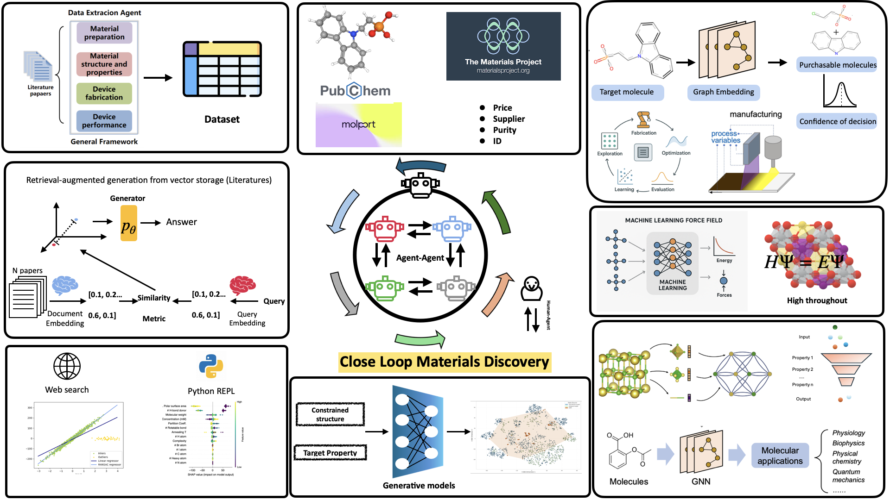

My name is **Bo Li**. I am currently a postgraduate student at NUS with a background in Materials Science.  

My research interests lie at the intersection of artificial intelligence and computational chemistry, with a focus on data-driven strategies to accelerate materials discovery.  

My prior work includes inverse materials design using transformer-based architectures and the development of a novel adapter module for classifier-free guidance. I have also explored the use of Large Language Models (LLMs) in multi-agent AI systems to enable text-guided molecule discovery.  

In the future, I aim to establish an automated materials discovery pipeline encompassing data mining, generative models for novel materials, property emulators that integrate machine learning with quantum mechanical methods, and domain-specific LLMs to execute and optimize experiments within a closed-loop discovery framework.  

# 🎓 Education

  

    <h3 style="margin: 0; color: #0073e6;">National University of Singapore (NUS)</h3>
    📍 Singapore, 2025–Present
  

  

    <b>MSc in Materials Science and Engineering</b>
  

  

    <h3 style="margin: 0; color: #0073e6;">Queen Mary University of London (QMUL)</h3>
    📍 United Kingdom, 2021–2025
  

  

    <b>BEng in Materials Science and Engineering</b> 
    🏆 First Class Honours (Top 10%)
  

## Research perspective

**Interesting topics**
1. Recently, I read a short report questioning whether inverse design truly accelerates materials discovery. Even advanced models like MatterGen sometimes suggest novel crystalline materials that, when synthesized, turn out to already exist — but in amorphous rather than crystalline form. This raises an important question: can we propose a new graph representation for amorphous materials? see [this article](https://www.nature.com/articles/d41586-025-03147-9)

2. The next major challenge is often described as the “elephant in the lab”: how can we connect theoretically accessible materials to practical synthesis routes? Generative models suggest materials that are challenging or even impossible to synthesize in reality. For further discussion, see [this article on ChemRxiv](https://chemrxiv.org/engage/chemrxiv/article-details/68b1ed3623be8e43d6d76098).

Above are issues that I want to solve, but automatic pipeline is my final aim. Below is my desired workflow for my future academic journey !

